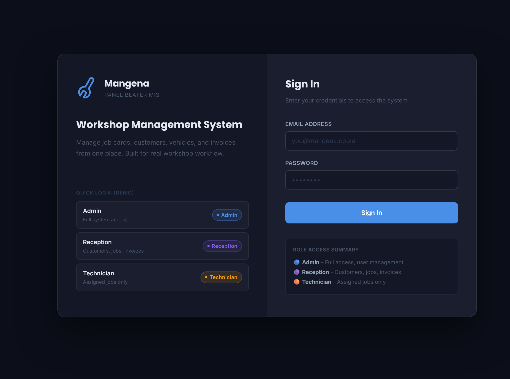
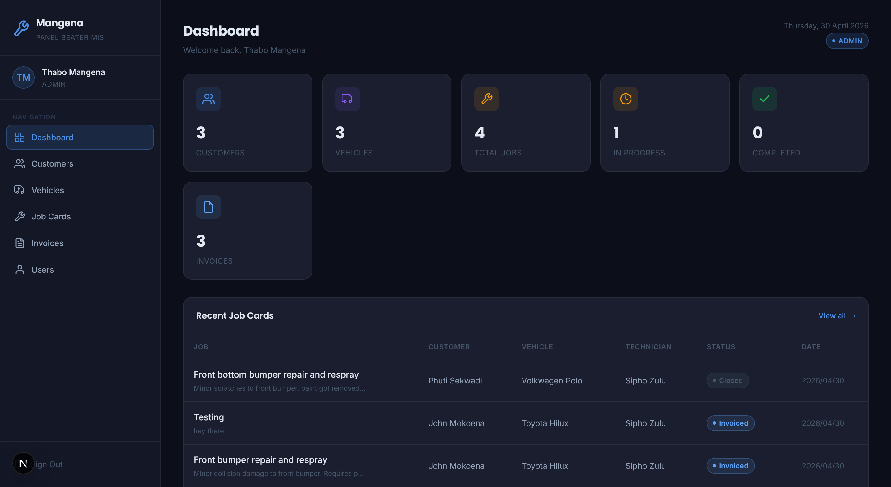
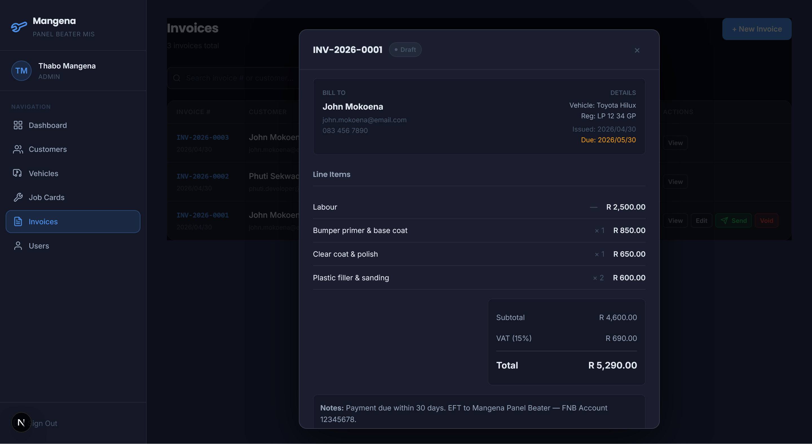
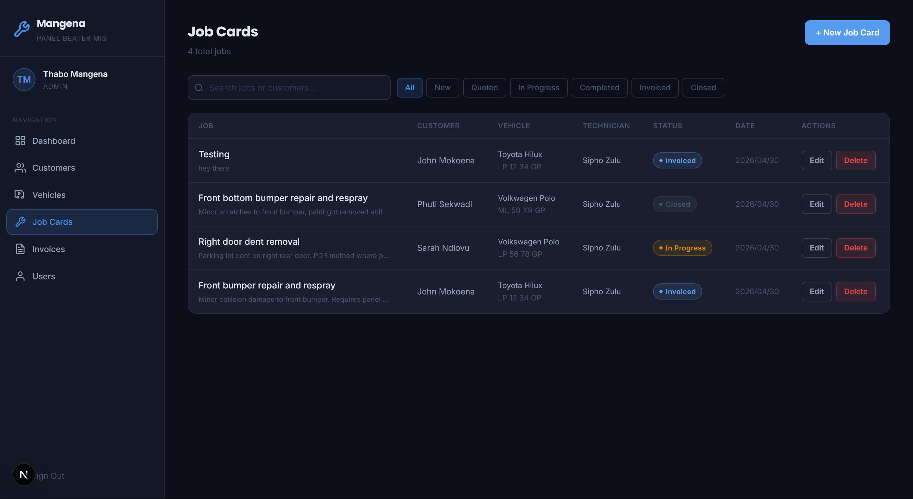
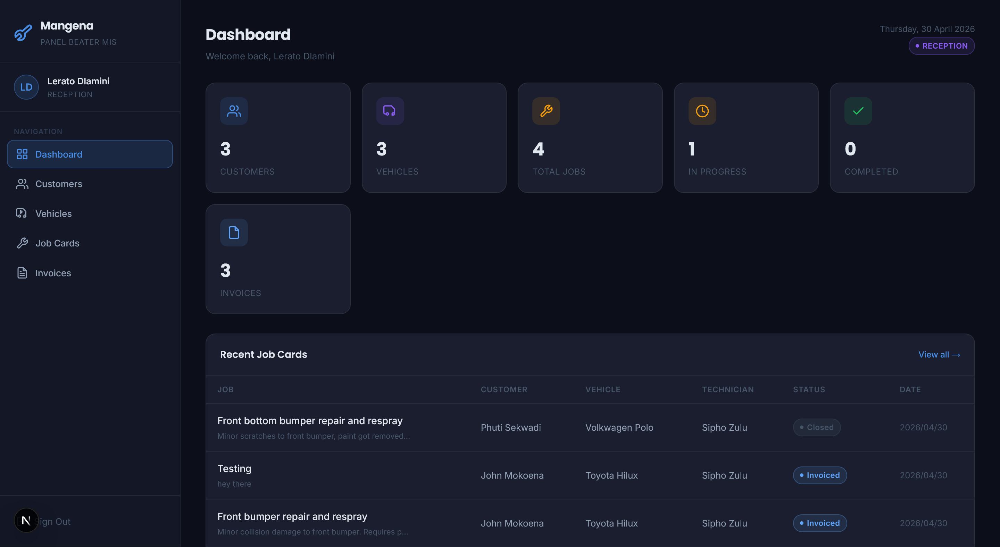
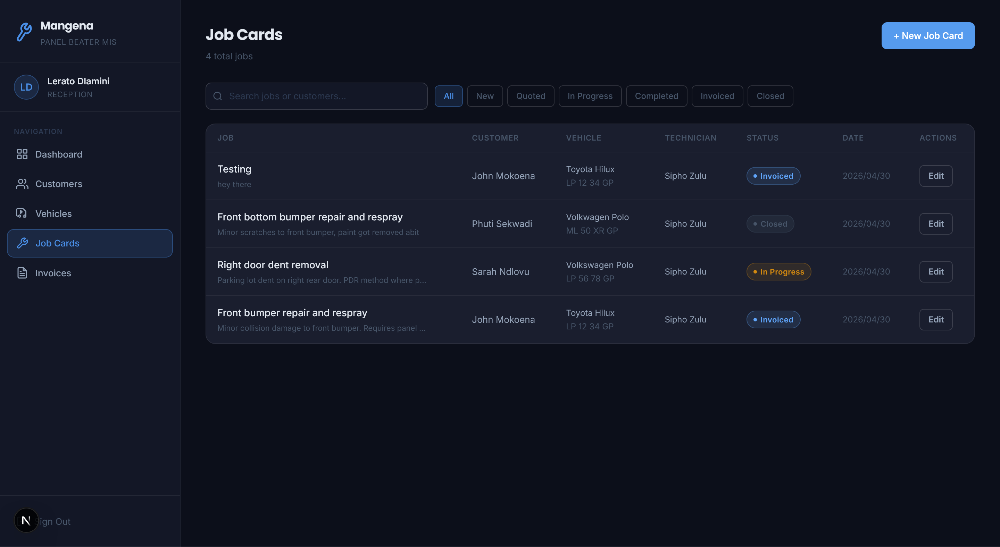
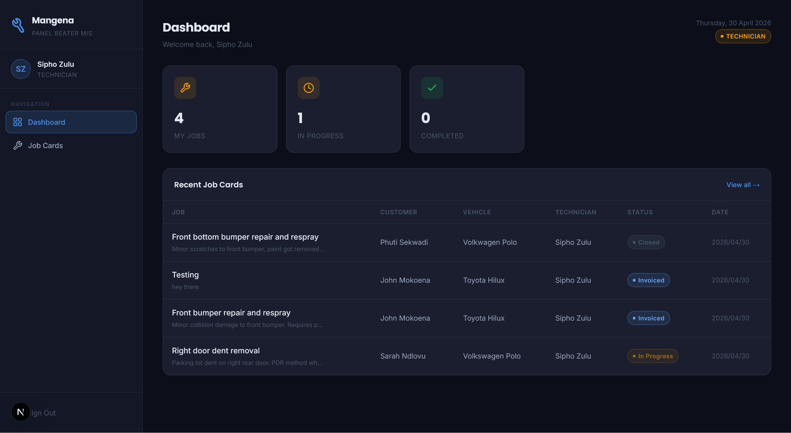

# 🚗 Mangena Panel Beater - Management Information System

A full-stack workshop management system designed for panel beating businesses to manage jobs, invoices, customers, vehicles, and staff roles through a structured digital workflow.

Built as an Honours-level Advanced Database Systems project using modern web technologies.

---

## 📸 Application Screenshots

### 🔐 Login



### 🧑‍💼 Admin Dashboard



### 🧾 Invoice Creation (admin)



### 🗑️ Admin Operations



### 🏢 Reception Dashboard



### 🔧 Reception Operations



### 🛠️ Technician Dashboard



---

## 📌 System Overview

This system digitises workshop operations:

- Customer management
- Vehicle registration per customer
- Job card lifecycle tracking
- Invoice generation and payment tracking
- Role-based access control (Admin / Reception / Technician)

---

## 👥 Academic Context

**Group 14 — University of Limpopo**  
**Module:** Advanced Database Systems (Honours)  
**Year:** 2026

**Team Members:**

- TP Sekwadi
- Mugeri R
- Ravhutulu M

---

## 🏗️ Tech Stack

- Next.js 16 (Full-stack framework)
- PostgreSQL (Relational database)
- Prisma ORM
- Tailwind CSS
- Framer Motion

---

## 🔐 Roles & Permissions

| Role       | Description                                 |
| ---------- | ------------------------------------------- |
| ADMIN      | Full system control (users, jobs, invoices) |
| RECEPTION  | Customers, vehicles, jobs, invoices         |
| TECHNICIAN | Assigned jobs only (status updates)         |

---

## ⚙️ Core Features

### 🧾 Job Management

- Create and assign jobs
- Track progress (New → In Progress → Completed → Invoiced → Closed)

### 💰 Invoice System

- Create invoices from jobs
- Itemised billing (parts, labour, VAT)
- Send, edit, void, mark as paid

### 👤 Customer & Vehicle Management

- Customer profiles
- Vehicle tracking with full history

### 👨‍🔧 User Management

- Admin-controlled staff accounts
- Role-based access system

---

## 📊 System Design

This project follows structured engineering principles:

- Software Development Life Cycle (SDLC)
- Database Development Life Cycle (DBLC)
- ERD, Use Case, and Flow Diagrams (see `/docs`)

---

# 📡 API DOCUMENTATION

All API routes are located under `/app/api`

---

## 🔐 Authentication

### `GET/POST /api/auth/[...nextauth]`

Handles authentication using NextAuth.

---

## 👤 Customers

### `GET /api/customers`

Fetch all customers

### `POST /api/customers`

Create new customer

### `GET /api/customers/[id]`

Get single customer

### `PATCH /api/customers/[id]`

Update customer

### `DELETE /api/customers/[id]`

Delete customer

---

## 🚗 Vehicles

### `GET /api/vehicles`

Fetch all vehicles

### `POST /api/vehicles`

Create vehicle

### `GET /api/vehicles/[id]`

Get vehicle details

### `PATCH /api/vehicles/[id]`

Update vehicle

### `DELETE /api/vehicles/[id]`

Delete vehicle

---

## 🧰 Jobs

### `GET /api/jobs`

Fetch all jobs

### `POST /api/jobs`

Create job

### `GET /api/jobs/[id]`

Get job details

### `PATCH /api/jobs/[id]`

Update job

### `DELETE /api/jobs/[id]`

Delete job

---

## 🧾 Invoices

### `GET /api/invoices`

Fetch all invoices

### `POST /api/invoices`

Create invoice from job

### `GET /api/invoices/[id]`

Get invoice details

### `PATCH /api/invoices/[id]`

Update invoice (edit / mark paid / void)

### `POST /api/invoices/[id]/send`

Send invoice to customer (email simulation or SMTP)

---

## 👨‍💼 Users

### `GET /api/users`

Fetch all users

### `POST /api/users`

Create user (Admin only)

### `GET /api/users/[id]`

Get user details

### `PATCH /api/users/[id]`

Update user

### `DELETE /api/users/[id]`

Delete user

---

## 🚀 Setup Instructions

```bash
npm install
```

### 3. Configure environment

Edit `.env.local` and set:

- `DATABASE_URL` — your PostgreSQL connection string
- `NEXTAUTH_SECRET` — any random string (at least 32 characters)
- `NEXTAUTH_URL` — `http://localhost:3000` for development
- `SEED_ADMIN_PASSWORD`=add_your_own_password
- `SEED_RECEPTION_PASSWORD`=add_your_own_password
- `SEED_TECH_PASSWORD`=add_your_own_password

### 4. Push database schema

```bash
npx prisma db push
```

### 5. Seed demo data

```bash
node scripts/seed.js
```

### 6. Start the app

```bash
npm run dev
```

Visit [http://localhost:3000](http://localhost:3000)

---

## 🔑 Demo Accounts

| Role       | Email                   | Password              |
| ---------- | ----------------------- | --------------------- |
| Admin      | admin@mangena.co.za     | add_your_own_password |
| Reception  | reception@mangena.co.za | add_your_own_password |
| Technician | tech@mangena.co.za      | add_your_own_password |

---

## 📈 Workflow Summary

1. Job created
2. Assigned to technician
3. Job completed
4. Invoice generated
5. Sent to customer
6. Payment marked as paid
7. Job closed

> To integrate real email sending, add your SMTP/API credentials to `.env.local`
> and replace the simulation block in `app/api/invoices/[id]/send/route.js`

---

## 📌 Status

🟢 **Production-ready academic system (Honours submission completed)**
